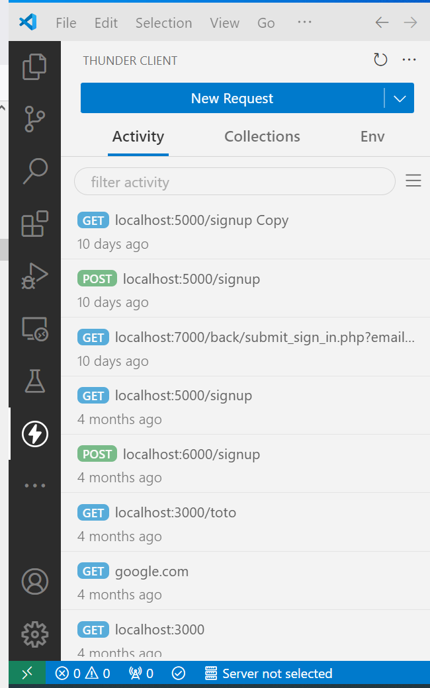

# Exercice 12 : gestion de l'inscription

---

## Modalités

- Effectuez vos tests via l'extension Visual Studio Code **`ThunderClient`** dans un premier, le lien entre le front et le back-end pourra être effectué plus tard.

---

## Enoncé

1. Gérez l'inscription d'un nouvel utilisateur depuis un serveur web (*API REST NODE JS*).
2. Stockez les utilisateurs dans un fichier JSON.

---

## Spécifications techniques

Effectuez vos appels sur le serveur *Node* via `ThunderClient``.
1. Pour simplifier l'exercice, créez manuellement un fichier `users.json` avec le contenu `[]`, ce dernier stockera les utilisateurs.

PS : [] sera interprêté lors de la première lecture du contenu comme un objet vide avec l'utilisation de la fonction JSON.parse
2. Les données depuis le client `ThunderClient` sont envoyées au format ***JSON***.
- 
3. Caractéristiques du serveur back-end :
- Écoute sur le port `7000` ;
- Méthode `POST` ;
- URL `/signup` ;
4. Réponses selon les scénarios :
- Si l'utilisateur existe déja dans le fichier, le serveur doit répondre au format ***JSON***  `{"message": "user already exists"}` avec un code HTTP `200`.
- Si l'utilisateur a été ajouté dans le fichier, le serveur répond au format ***JSON*** `{"message": "sucess"}` avec un `code HTTP` égale à `201`.
- Dans tous les autres cas retourner un `code HTTP 404`.

## Quelques illustrations de l'utilisation de l'extension ThunderClient (non contractuelle vis-à-vis de l'exercice)

---

